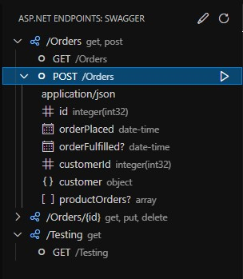

# asp-net-swagger-viewer README

Super simple and [bodged](https://www.youtube.com/watch?v=lIFE7h3m40U) together extension to view your api over swagger.

This extension only supports body parameters.

